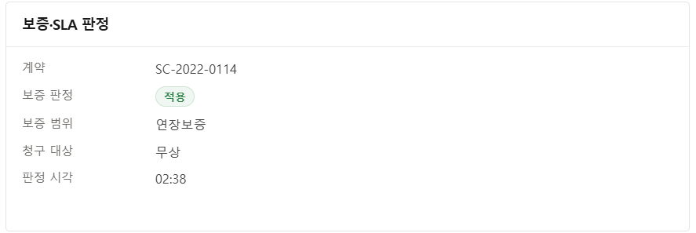

# 데이터 모델

[← README](../README.md)

---

## 1. 레코드 연결 구조

고객 · 계약 · Asset · Case · Work Order를 하나의 축으로 연결했습니다.

```
                     PRODUCT
                        │ 설치
                        ↓
  ACCOUNT ── 보유 ──> ASSET ────── 작업대상 ──────────────┐
     │                  │                                │
     │ 담당자            │ 장애                            │
     ↓                  ↓                                ↓
  CONTACT ── 신고 ──>  CASE ── 작업생성 ──> WORK_ORDER ──┴─> WORK_ORDER_LINE_ITEM
                        │                      ↑                (측정 항목)
                        │ 원인분석              │ 조치
                        ↓                      │
                     PROBLEM ──────────────────┘

  ENTITLEMENT ── 보증 · SLA ──> CASE
```

| 객체 | 역할 |
| --- | --- |
| `Account` / `Contact` | 고객사와 담당자 |
| `Product` / `Asset` | 제품 모델과 현장에 설치된 실제 장비 |
| `Case` | 장애 접수 단위. 모든 흐름의 축 |
| `WorkOrder` / `WorkOrderLineItem` | 현장 작업 지시와 측정 항목 |
| `Problem` | 반복 장애의 근본 원인 분석 |
| `ServiceContract` / `Entitlement` | 계약과 보증 · SLA 기준 |

---

## 2. 표준 객체를 축으로 둔 이유

장비 · 서비스 요청 · 작업 지시는 **표준 객체**를 그대로 썼습니다.
표준 객체를 쓰면 Service Cloud의 SLA · 콘솔 · 모바일 · 리포트 기능이 별도 구현 없이 붙습니다. 전부 커스텀으로 만들면 당장은 빠르지만, 그 기능을 그때부터 직접 만들어야 합니다.

표준에 담기지 않는 정보만 커스텀 객체로 확장했습니다.

| 커스텀 객체 | 담는 것 |
| --- | --- |
| `Customer_Commitment__c` | 계약 약정 |
| `Technical_Review__c` | 기술 검토 |
| `Technical_Baseline__c` | 기술 기준선 |
| `Technical_Baseline_Spec__c` | 기준선 상세 사양 |
| `Asset_Context_Pending__c` | 자산 컨텍스트 대기 |
| `Customer_Alert__c` | 고객 알림 |

---

## 3. Master-Detail을 선택한 기준

커스텀 객체는 Lookup이 아니라 Master-Detail로 연결했습니다.

| 기준 | Master-Detail | 이 프로젝트에서 |
| --- | --- | --- |
| 삭제 | 부모가 지워지면 자식도 지워진다 | 장비가 폐기되면 그 장비의 기술 기준선과 검사 항목은 남아 있을 이유가 없습니다 |
| 권한 | 부모의 접근 권한을 따른다 | 장비를 볼 수 있는 사람만 그 장비의 계약 약정을 봐야 합니다. 자식마다 권한을 따로 관리하면 어긋납니다 |
| 집계 | 부모에서 롤업 요약을 쓸 수 있다 | 기준선 1건에 검사 항목 여러 건이 붙는 구조라 부모에서 바로 집계해야 했습니다 |

반대로 자식이 부모 없이도 존재해야 하거나, 부모가 바뀔 수 있거나, 권한을 따로 줘야 하는 경우에는 Lookup이 맞습니다.
관계 유형은 **삭제 · 권한 · 집계 세 가지를 어떻게 할 것인가**의 결과로 정했습니다.

---

## 4. 서비스 수준(SLA)

Entitlement Process · Milestone · Business Hours로 구성했습니다.

| 등급 | 상황 | 응답 | 복구 |
| --- | --- | --- | --- |
| S1 | 가동 중단 | 15분 | 4시간 |
| S2 | 성능 저하 | 30분 | 8시간 |

```
S1  접수 ──── 15분 ────────────────────────────── 4시간
             응답 목표                             복구 목표

S2  접수 ──── 30분 ────────────────────────────── 8시간
```

| 구성 요소 | 역할 |
| --- | --- |
| Entitlement Process | 접수부터 복구까지의 단계 정의 |
| Milestone | 응답과 복구 각각의 목표 시각을 레코드에 기록 |
| Business Hours | 영업시간 기준 계산 — 야간 · 휴일은 시간에 포함되지 않음 |



보증 판정은 계약 레코드에서 가져와 Case 화면에 표시합니다. 담당자가 계약서를 따로 찾지 않습니다.

SLA를 필드에 수동으로 적어 두면 사람이 계산하고 사람이 놓칩니다. 표준 기능으로 구성하면 남은 시간이 화면에 계속 표시되고 초과가 자동으로 기록됩니다.

---

## 5. 권한

역할별 Permission Set 4종으로 접근 범위를 나누고, 커스텀 필드에는 필드 단위 접근 제어(FLS)를 적용했습니다.
필수 필드와 수식 필드는 FLS 부여 대상에서 제외했습니다.

---

## 6. 활용 환경

| | |
| --- | --- |
| 에디션 | Salesforce Enterprise Edition |
| 클라우드 | Service Cloud (Case · Asset · Work Order) · Experience Cloud (고객 포털) |
| AI | Agentforce (브리핑 · RCA) |
| 자동화 | Flow · Validation Rule |
