# 데모 시나리오

[← README](../README.md)

CDU-A-07 한 대의 이상 신호가 네 장면을 거쳐 예방과 다음 제안으로 확장됩니다.

```
SCENE 01          SCENE 02          SCENE 03          SCENE 04
고객 접점    →     출동 판단    →     현장 복구    →     예방 확장
고객↔서비스        서비스↔설계·현장    현장↔서비스        서비스↔영업
```

---

## SCENE 01 — 이상 신호가 상담과 Case로 끊김 없이 이어진다

> **고객 · 시설 담당자** — "A-07 유량이 계속 떨어지고 있습니다." (14:14 문의 접수)

| | |
| --- | --- |
| 01 | A-07 이상 상태 확인 — 유량 1,961 L/min (기준 2,100) |
| 02 | 고객 포털에서 채팅 시작 |
| 03 | AI 상담으로 조치 방법 안내 |
| 04 | 상담사가 같은 대화를 그대로 인계 |
| 05 | 접수 기록 생성 · 고객 이력 확인 |

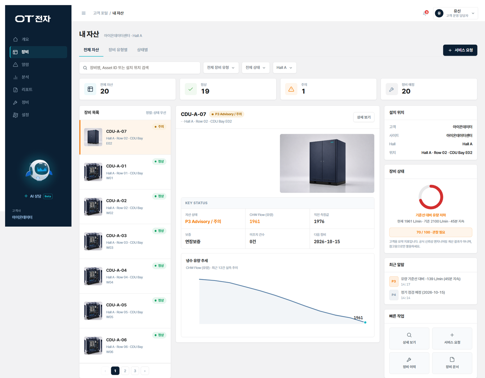

고객 포털 · 내 자산 — 보유 20대 중 주의 1대(CDU-A-07)가 표시됩니다. 고객이 냉수 유량 추세와 최근 알림을 직접 확인하고 서비스 요청까지 이어갈 수 있습니다.

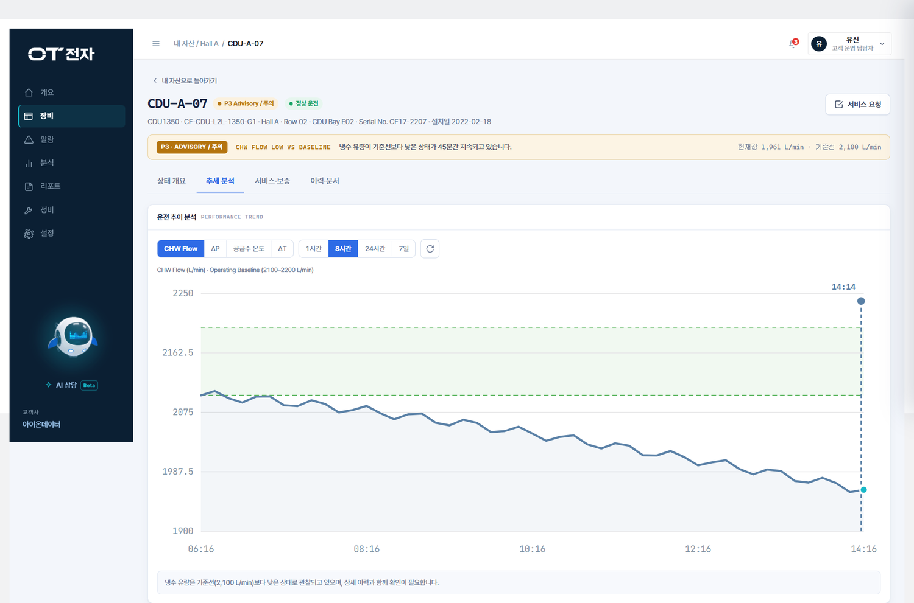

추세 분석 — 기준선 대비 하락 폭과 최근 측정 이력을 고객 화면에서 제공합니다.

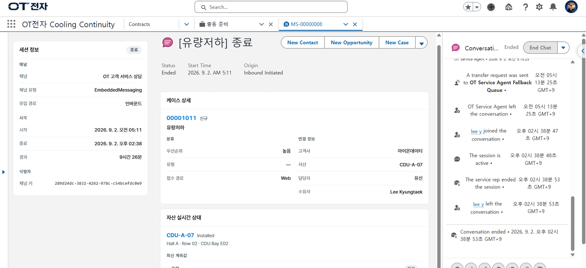

Messaging Session — 상담이 종료되면 대화 이력과 함께 Case가 생성되고, 자산 실시간 상태가 같은 화면에 붙습니다.

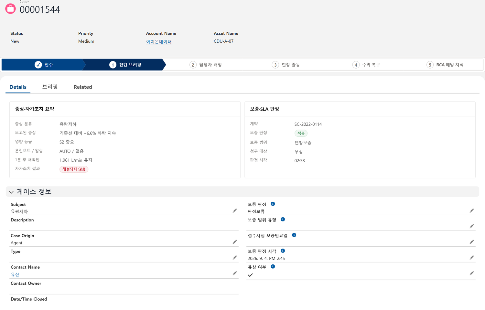

장애 접수 패널 — 증상 요약과 보증 · SLA 판정, 진행 단계가 한 화면에 표시됩니다.

**결과** — 고객은 설명을 반복하지 않고, 상담사는 자산 · 계약 · 보증 · SLA가 연결된 맥락에서 바로 대응합니다.

---

## SCENE 02 — 출동은 데이터와 전문가 협업으로 결정된다

> **서비스 담당자** — "변경 이력과 유사 사례를 보면 출동이 필요합니다." (출동 확정 · 도착 예정 15:30)

| | |
| --- | --- |
| 01 | AI 출동 브리핑 — 우선순위 근거 · 점검 후보 · 장비 이력 |
| 02 | 동일 Hall 12대 비교 · 변경 이력 · 유사 사례 확인 |
| 03 | Slack Swarming — 설계 · 현장 전문가 채널 자동 생성 |
| 04 | 전문가 검토 후 담당 엔지니어 배정 → Work Order 자동 생성 |
| 05 | Case Path '현장 출동' 전환 · 고객에게 방문 일정 통보 |

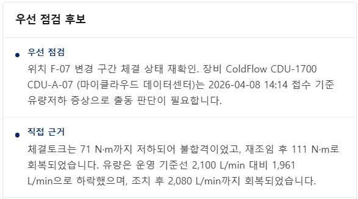

우선 점검 후보와 직접 근거가 함께 출력됩니다.

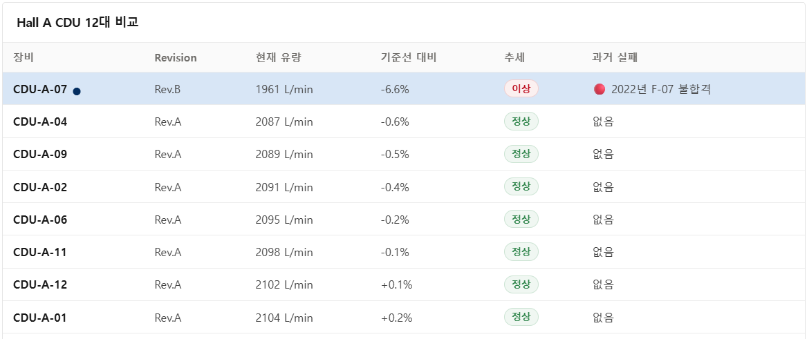

**12대 모두 판정은 정상인데 CDU-A-07만 추세가 이상입니다.**
사양 대비 합격 여부(판정)와 기준선 대비 변화(추세)를 분리해 다루도록 설계한 이유가 이 장면입니다. 한 칸에 섞었다면 이 장비는 정상으로 넘어갔을 것입니다.

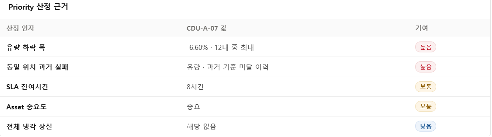

등급마다 어떤 값이 근거였는지를 함께 출력합니다. 값이 없는 항목은 "해당 없음"으로 표시되어 미측정과 이상이 구분됩니다.

**결과** — AI가 판단 근거를 준비하고 전문가가 원기록을 검토한 뒤, 담당자가 출동을 최종 승인합니다. 접수 31분 만에 Work Order가 발행됩니다.

---

## SCENE 03 — 현장 조치가 기록과 검증으로 남는다

> **서비스 기술자** — "과거 변경 위치에서 동일한 이상이 확인됐습니다."

| | |
| --- | --- |
| 01 | Field Service Mobile 알림 — 브리핑 · Case · Asset 함께 전달 |
| 02 | 15:30 현장 도착, 점검 시작 |
| 03 | 체결토크 71 → 111 N·m 재체결 · 유량 2,080 L/min 회복 |
| 04 | 조치 결과 자동 알림 → 고객 확인 |
| 05 | 18:24 복구 확인 (접수 후 4시간 10분) |

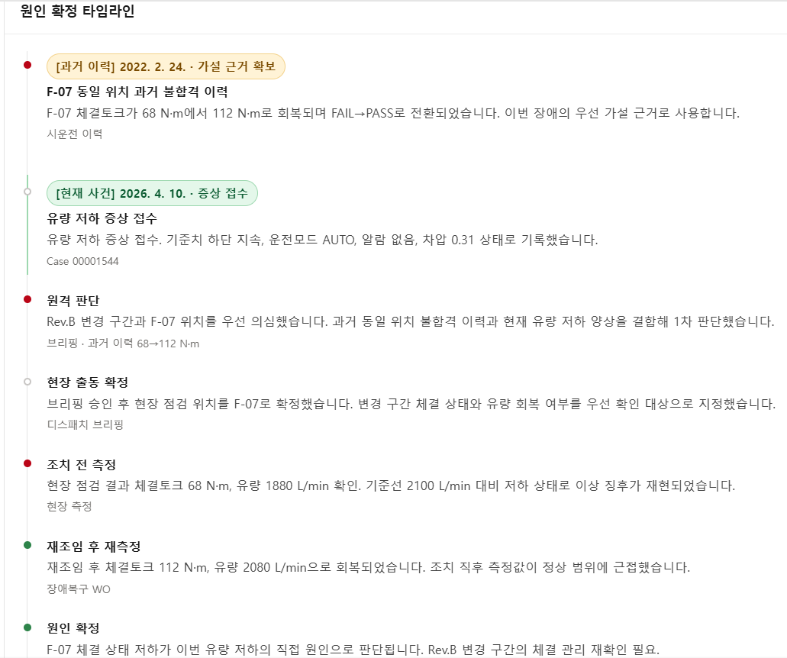

원인 확정 타임라인 — **2022년 시공 기록과 2026년 장애가 같은 타임라인에 놓입니다.**
4년 전 재시험 합격값(112 N·m)이 이번 조치의 판단 근거로 사용됩니다.

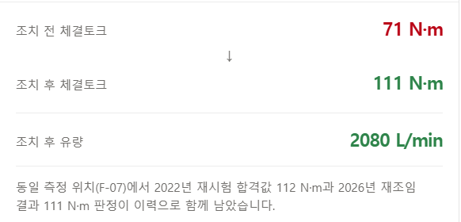

조치 전후 측정값과 과거 합격값을 같은 카드에서 대조합니다.

**결과** — 현장 결과가 Work Order에 즉시 반영되고, 접수 4시간 10분 만에 고객이 복구를 확인합니다.

---

## SCENE 04 — 한 대의 복구를 전사 예방과 다음 제안으로 확장한다

> **영업 담당자** — "갱신 근거는 서비스 기록에 있습니다."

| | |
| --- | --- |
| 01 | 근본 원인 분석 — 동일 조건 11대 예방점검 · 점검표 Rev.3 |
| 02 | Case 종결 — 결과 · SLA · 재발 방지 고객 안내 |
| 03 | 계약 갱신 Task 알림 — 종료 D-61 |
| 04 | Service Contract 정비 이력 확인 |
| 05 | 갱신 Opportunity 생성 |

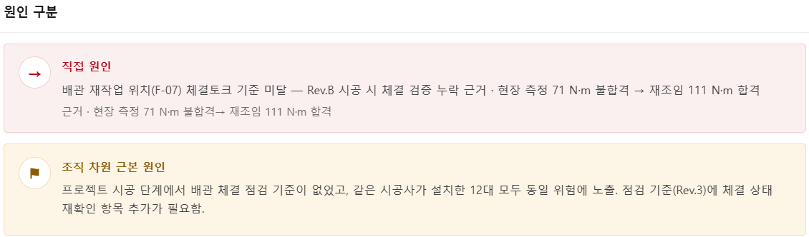

직접 원인과 조직 차원 근본 원인을 분리해 기록합니다.
**같은 시공사가 설치한 12대 전부가 같은 위험에 노출돼 있다**는 사실이 여기서 드러납니다.

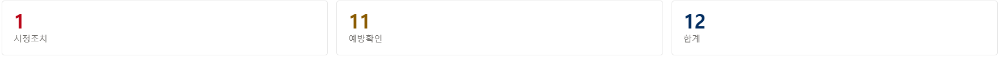

근본 원인이 시정 1건과 나머지 11대의 예방 작업으로 이어집니다.

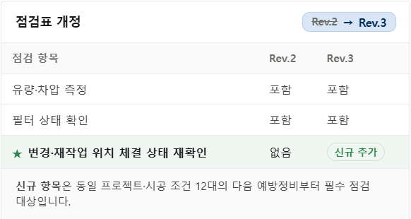

조치가 점검표 개정(Rev.2 → Rev.3)까지 연결되어 재발 경로를 막습니다.
신규 항목은 동일 프로젝트 · 시공 조건 12대의 다음 예방정비부터 필수 점검 대상이 됩니다.

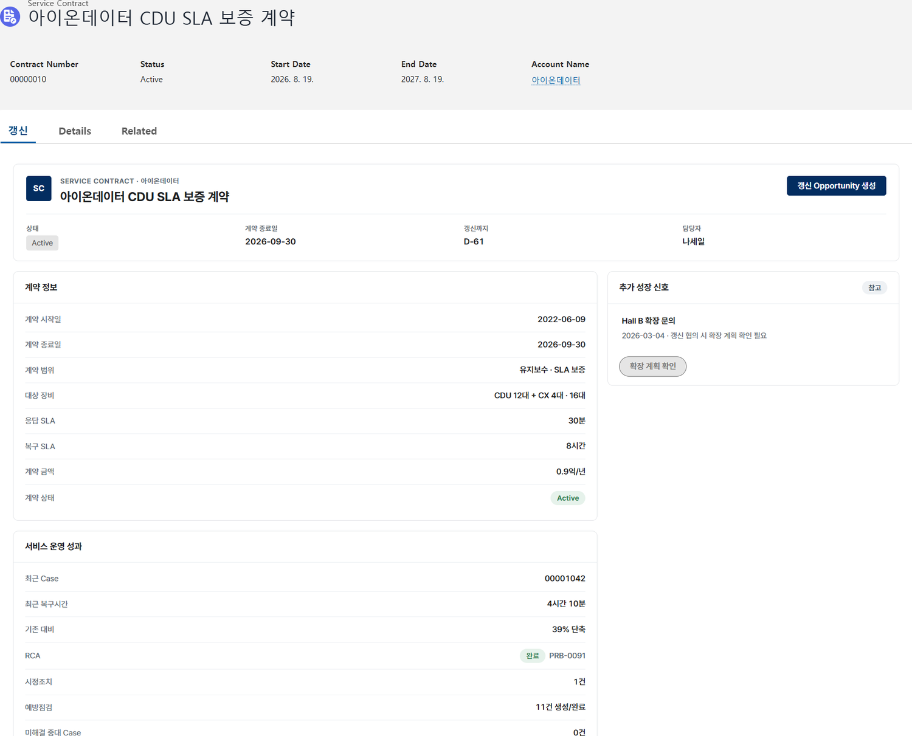

축적된 서비스 성과가 계약 갱신 검토의 근거가 됩니다. 계약 종료 D-61에 갱신 검토 Task가 자동 생성됩니다.

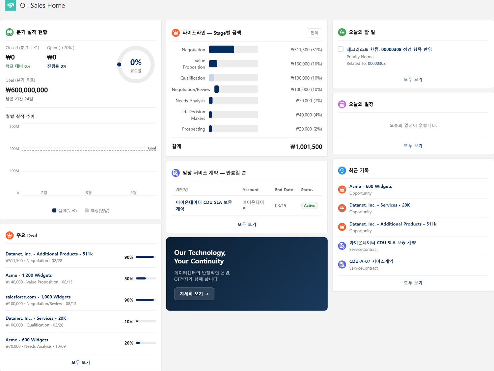

영업 담당자는 서비스 이력이 연결된 상태에서 갱신 Opportunity를 판단합니다. 시스템은 검토 시점과 근거를 연결하고, 최종 결정은 사람이 합니다.

**결과** — 한 번의 장애가 12대의 재발 방지 업무와 조직 지식, 다음 영업 기회로 전환됩니다.
